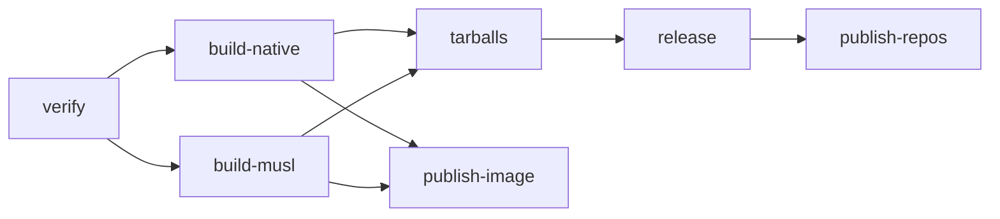

# Developing darn

This guide covers:
- setting up a machine to build darn
- building the binary and its packages
- running the tests
- operating the CI/CD pipeline that checks every push and publishes releases.

For using darn, see the [README](../README.md).

## Setting up a build environment

darn is a single Rust crate. Its C dependencies (libssh2, OpenSSL, SQLite and
zlib) are vendored and compiled as part of the build, so no `-dev` packages or
system libraries are involved. You need:

- Rust 1.88 or later — the `rust-version` in `Cargo.toml`, which CI enforces
- a C compiler and `make`
- `perl`, which runs OpenSSL's `Configure` script

The first build takes a few minutes, most of it compiling OpenSSL. Later builds
reuse that.

### Ubuntu and Debian

One script does the whole setup:

```sh
util/initialise-ubuntu-build-deps.sh          # toolchain, then a release build
util/initialise-ubuntu-build-deps.sh --musl   # also the static musl target
```

The script:
- installs `build-essential`, `curl`, `ca-certificates`, `git`, `pkg-config`
  and `perl`, plus `musl-tools` and `musl-dev` with `--musl`
- installs Rust through rustup if there is no `cargo` on your PATH, and warns
  if an existing `rustc` is older than 1.88
- runs `cargo build --release`
- symlinks `~/.cargo/bin/darn` to `target/release/darn`, so each later release
  build is on your PATH without reinstalling.

Every step checks before acting, so it is safe to re-run.

### RHEL, Alma, Rocky and Fedora

Install the compiler and perl, then Rust:

```sh
sudo dnf install gcc make perl "perl(IPC::Cmd)" "perl(Time::Piece)"
curl --proto '=https' --tlsv1.2 -sSf https://sh.rustup.rs | sh
```

RHEL 8-family systems split perl into subpackages, and OpenSSL's `Configure`
needs the two modules named above. Without them the build fails inside
`openssl-src` with `Can't locate IPC/Cmd.pm in @INC`.

rustup installs into `~/.cargo/bin`. A shell that has not read your profile
since then will not find `cargo` until you run `. "$HOME/.cargo/env"`.

## Building

```sh
cargo build             # debug build:     target/debug/darn
cargo build --release   # optimised build: target/release/darn
```

The release profile strips symbols and uses thin LTO with a single codegen
unit, so it links much more slowly than a debug build. Use debug builds while
iterating.

A binary built this way links against your own system's glibc, so it may not
run on an older distribution. The published packages are built in an older
environment for exactly that reason; see
[Native packages and the glibc floor](#native-packages-and-the-glibc-floor).

### Static musl binary

The release tarball and the container image use a fully static binary:

```sh
rustup target add x86_64-unknown-linux-musl
sudo apt install musl-tools musl-dev
CC_x86_64_unknown_linux_musl=musl-gcc \
    cargo build --release --target x86_64-unknown-linux-musl
# binary at target/x86_64-unknown-linux-musl/release/darn
```

`musl-gcc` compiles the vendored C libraries against musl. Rust's musl binaries
are static-PIE. To confirm the binary needs no dynamic loader, check that
`readelf -l <binary> | grep interpreter` prints nothing. Don't go by `ldd`: its
wording differs between static and static-PIE binaries.

### Man page and completions

Both are generated from the binary itself:
- `darn man` prints the roff man page. It is a hidden command, for packaging.
- `darn completions bash|zsh|fish` prints a completion script.

The man page is built from the doc comments on the clap structs in
`src/main.rs`, so edit the text there, not in the generated file.

`ci/gen-dist.sh [install-path] [output-dir]` generates the whole set into
`dist/` for packaging. The completion scripts embed the absolute path of the
binary that generated them. So the script first *installs* `target/release/darn`
at the path the package will use, `/usr/bin/darn` by default, and generates
from there. It also writes PATH-relative copies to `dist/completions-portable/`
for the tarball, and fails if a build path has leaked into either set.
Because it writes to `/usr/bin`, it is meant to run as root inside a build
container, as CI runs it. `dist/` is ignored by git.

### Packages

The most faithful local package build repeats CI's steps in CI's own image.
That also gives the packages the same glibc floor as a real release:

```sh
docker run --rm -it -v "$PWD":/src -w /src quay.io/pypa/manylinux_2_28_x86_64 bash
# then, inside the container:
dnf -y install "perl(IPC::Cmd)" "perl(Time::Piece)"
curl --proto '=https' --tlsv1.2 -sSf https://sh.rustup.rs | sh -s -- -y --profile minimal
. "$HOME/.cargo/env"
cargo install cargo-deb cargo-generate-rpm --locked
cargo build --release --locked
ci/gen-dist.sh /usr/bin/darn dist
cargo deb --no-build --no-strip         # target/debian/darn_<version>-1_amd64.deb
cargo generate-rpm --auto-req auto      # target/generate-rpm/darn-<version>-1.x86_64.rpm
```

The container runs as root, so everything it writes into `target/` and `dist/`
is owned by root on the host. Afterwards, run `sudo chown -R "$USER" target
dist`, or build from a copy of the tree (`git archive HEAD | tar -x -C
/some/dir`).

The container image is assembled from a prebuilt musl binary. The comment at the
top of the `Dockerfile` gives the local build steps.

## Running the tests

```sh
cargo test
```

The tests take under a second once the crate is built. They live beside the code
in `#[cfg(test)]` modules; there is no `tests/` directory. They need no network,
no SSH server and no setup: database tests use temporary directories. A few
tests shell out to `sh`. The `darn` user provisioning script is syntax-checked
with `sh -n`, and the `authorized_keys` install command is run against a
throwaway `HOME`.

The output parsers are pure functions, and darn3's test suite is ported
alongside them. They cover apt's simulate output, needrestart,
`dnf check-update` and `updateinfo`, and RouterOS, along with the
restart-verdict precedence ladders. When a host's output trips up a parser,
add that output as a test case there.

### Run what CI runs before pushing

CI sets `RUSTFLAGS=-D warnings` for every job, so any compiler or clippy warning
fails the build:

```sh
export RUSTFLAGS="-D warnings"
cargo test --locked --all-targets
cargo fmt --all --check
cargo clippy --locked --all-targets
rustup toolchain install 1.88          # once
cargo +1.88 check --locked --all-targets
```

`--locked` fails if `Cargo.lock` would change. Commit lock-file changes together
with the dependency change that caused them. Changing `RUSTFLAGS` forces a full
rebuild, so you may prefer to set it only in the shell where you run these
checks.

### Tests that need outside resources

Two tests return immediately unless an environment variable points them at
something:

| Variable | Test | What it needs |
|---|---|---|
| `DARN_STREAM_HOST`, optionally `DARN_STREAM_USER` (default `$USER`) | `ssh::channel::streaming_tests` checks that output is streamed while a command is still running | A host you can reach on port 22 with your key. It only runs `echo` and `sleep`. |
| `DARN_PY_QUOTED`, optionally `DARN_DUMP` (path to write the actual output) | `hosts::quoting_parity_tests` compares sudo quoting with Python's `shlex.quote` | A file of the expected output, generated with Python's `shlex.quote` |

```sh
DARN_STREAM_HOST=myhost cargo test streaming -- --nocapture
```

### Trying changes against real hosts

Throwaway containers make safe targets. This one is a password-only Ubuntu host
with a sudo-capable `tester` user. It takes about 45 seconds to come up:

```sh
docker run -d --name darn-test -p 2222:22 ubuntu:24.04 sh -c '
  apt-get update -qq &&
  DEBIAN_FRONTEND=noninteractive apt-get install -y -qq openssh-server sudo &&
  mkdir -p /run/sshd && useradd -m -s /bin/bash -G sudo tester &&
  echo tester:pw | chpasswd && exec /usr/sbin/sshd -D -e'
```

For the redhat handler, use `almalinux:9` with `openssh-server sudo passwd`.
Run `ssh-keygen -A` before starting `sshd`, put the user in the `wheel` group
rather than `sudo`, and set the password with `echo pw | passwd --stdin tester`.

Keep your real keys, `known_hosts` and database out of it. Give darn its own
`HOME`, key and database, and hide your SSH agent:

```sh
T=$(mktemp -d)
mkdir -m700 "$T/.ssh" && ssh-keygen -q -t ed25519 -N '' -f "$T/.ssh/id_ed25519"
alias tdarn="env -u SSH_AUTH_SOCK HOME=$T target/debug/darn --db $T/darn.db"
tdarn server add tester@localhost:2222
```

A few things to know:

- **The prompts need a real terminal.** `server add`, `shell` and single-host
  `update` ask their questions only when stdin is a terminal. Piping answers in
  does not work either: the password prompt flushes any input already typed
  ahead. Answer each prompt after it appears, by hand or with a pty driver
  that waits for it.
- **`darn shell` runs ssh(1).** ssh finds `~/.ssh` through the password
  database, not `$HOME`, so it uses your real `known_hosts` and keys. To point
  it at the throwaway ones, put a wrapper named `ssh` first on your PATH that
  adds `-o UserKnownHostsFile=$T/.ssh/known_hosts -o IdentityFile=$T/.ssh/id_ed25519`.
- **The hostname is the key in darn's server list.** Two containers both
  published on `localhost` count as one host, so adding the second replaces the
  first. Use a separate `--db` for each.

## CI/CD

Three GitHub Actions workflows live in `.github/workflows/`:

| Workflow | Runs on | Does |
|---|---|---|
| `ci.yml` | Every push to `main`, every pull request | Tests, lint, MSRV check, package build and install tests |
| `audit.yml` | Mondays at 06:00 UTC, pushes that change `Cargo.toml`, `Cargo.lock` or the workflow, and manual runs | `cargo audit` |
| `release.yml` | Pushing a tag matching `v*` | Builds and publishes a release |

### ci.yml

- **test**, **lint** and **msrv** run the commands in
  [Run what CI runs before pushing](#run-what-ci-runs-before-pushing). The msrv
  job reads the toolchain version from `rust-version` in `Cargo.toml`.
- **package-smoke** builds the `.deb` and `.rpm` exactly as a release does.
- **package-install** installs those packages on `debian:11`, `debian:12`,
  `ubuntu:20.04`, `rockylinux:8`, `almalinux:9` and `fedora:latest`. On each it
  checks that:
  - the binary runs, which proves the glibc floor is low enough
  - the man page is in the package
  - the bash completion script calls `/usr/bin/darn` rather than a build path
  - completion works with no database present.

A newer push to the same branch cancels a run still in progress.

### audit.yml

OpenSSL, SQLite and libssh2 are compiled into the darn binary, so a distribution
updating its own `openssl` package does nothing for darn. When an advisory
against one of these dependencies fails this job, update the affected crate
(for example `cargo update -p openssl-src`) and cut a release. Informational
advisories, such as unmaintained or yanked crates, appear in the log but do not
fail the job. To run it locally:

```sh
cargo install cargo-audit --locked
cargo audit
```

### Native packages and the glibc floor

The `.deb` and `.rpm` are built inside `quay.io/pypa/manylinux_2_28_x86_64`,
which is AlmaLinux 8 with glibc 2.28. The result runs on RHEL-family 8 and
later, Debian 11 and later, and Ubuntu 20.04 and later. Built on the stock
`ubuntu-latest` runner instead, it would need glibc 2.39, which none of those
older distributions have.

Everything except libc and zlib is compiled in, so the `.deb` declares its
dependencies explicitly (`libc6 (>= 2.28), zlib1g`) rather than computing them.
`cargo-deb` and `cargo-generate-rpm` are pure Rust and need neither `dpkg` nor
`rpmbuild`. Package metadata lives in `Cargo.toml` under
`[package.metadata.deb]` and `[package.metadata.generate-rpm]`.

### What a release publishes



1. **verify** fails unless the tag matches the version in `Cargo.toml`. A tag
   with a hyphen, such as `v0.4.0-rc.1`, marks a prerelease.
2. **build-native** builds the `.deb` and `.rpm` in the manylinux image. It also
   passes the generated man page and completions on to the later jobs.
3. **build-musl** builds the static binary, and fails if the binary requests a
   dynamic loader.
4. **tarballs** packs `darn-<version>-x86_64-linux-musl.tar.gz` with the binary,
   README, licence, man page and PATH-relative completions.
5. **release** writes `SHA256SUMS`, creates a build provenance attestation for
   each package and tarball, and publishes a GitHub Release with generated
   notes.
6. **publish-image** pushes `ghcr.io/getdarn/darn:<version>`, and also `:latest`
   unless it is a prerelease. The image is assembled from the musl binary, with
   no compile step.
7. **publish-repos** pushes the packages to the Cloudsmith repository
   `getdarn/darntest`, as `any-distro/any-version`. Prereleases skip this job.

### Secrets and settings

- **`CLOUDSMITH_API_KEY`**: a repository secret, used by publish-repos.
- **`GITHUB_TOKEN`** is provided automatically. It creates the release and the
  attestations, and pushes the image to GHCR. Each job declares only the
  permissions it needs.
- **Visibility.** The GHCR package and the Cloudsmith repository must be public
  for the README's Docker, apt and dnf install instructions to work for anyone
  else. The workflow authenticates to both, so a green run does not prove
  this. Check it logged out:

  ```sh
  docker logout ghcr.io && docker pull ghcr.io/getdarn/darn:latest
  curl -fsSI https://dl.cloudsmith.io/public/getdarn/darntest/setup.deb.sh
  ```

  As of v0.3.0 both were still private. To fix it, change the visibility in
  the GHCR package's settings on GitHub, and in the Cloudsmith repository's
  settings.

## Cutting a release

Releases are cut with [cargo-release](https://github.com/crate-ci/cargo-release),
configured in `release.toml`. Before you start:

- Install it once with `cargo install cargo-release --locked`.
- Be on `main` with a clean working tree, up to date with `origin`.
- Make sure CI is green for the commit you are releasing.

Choose the version by semver. While darn is pre-1.0, a release that adds
features bumps the minor version.

```sh
cargo release 0.4.0              # dry run: shows the changes and what would be pushed
cargo release 0.4.0 --execute    # asks for confirmation, then does it
```

cargo-release then:
1. sets the version in `Cargo.toml` and `Cargo.lock`
2. updates the version in the README's tarball install snippet, using the
   `pre-release-replacements` patterns in `release.toml`
3. commits `chore: Release darn version 0.4.0`
4. creates the annotated tag `v0.4.0`
5. pushes `main` and the tag.

The tag starts `release.yml`. Nothing goes to crates.io: `publish = false`,
because the `darn` name there belongs to an unrelated crate.

### Tag signing

`release.toml` sets `sign-tag = true`, so `git tag -s` must work on your
machine, with either a GPG key or SSH signing:

```sh
git config --global gpg.format ssh
git config --global user.signingkey ~/.ssh/id_ed25519.pub
```

Without a signing key, the release fails when it tries to create the tag.
v0.1.0 to v0.3.0 were released unsigned, using a copy of the config with
signing turned off:

```sh
sed 's/^sign-tag = true/sign-tag = false/' release.toml > /tmp/release-nosign.toml
cargo release 0.4.0 --isolated -c /tmp/release-nosign.toml --execute
```

Add `--no-confirm` to skip the confirmation prompt when running without a
terminal.

### Prereleases

`cargo release 0.4.0-rc.1 --execute` publishes a GitHub prerelease. It pushes
the image under its version tag only, not `:latest`, and skips Cloudsmith.

Beware of the README, though. The `pre-release-replacements` patterns match
only `X.Y.Z`. A prerelease writes `darn-0.4.0-rc.1-x86_64-linux-musl.tar.gz`
into the install snippet, which the `/releases/latest/` URL does not serve.
The following final release then leaves the `-rc.1` in place. Correct the
snippet by hand after a prerelease, or widen the patterns first.

### After a release

Watch the workflow, then check what it published:

```sh
gh run list --repo getdarn/darn --limit 4
gh run watch <run-id> --repo getdarn/darn --exit-status

gh release download v0.4.0 --repo getdarn/darn --dir /tmp/darn-v0.4.0
cd /tmp/darn-v0.4.0
sha256sum -c SHA256SUMS
for f in *.deb *.rpm *.tar.gz; do gh attestation verify "$f" --repo getdarn/darn; done
```

If a job fails for a transient reason, rerun just the failed jobs with
`gh run rerun <run-id> --failed`. If the failure is in the code or the
workflow, fix it on `main` and release the next patch version, rather than
moving a tag that has already been pushed.

### Raising the MSRV

Update `rust-version` in `Cargo.toml`, which is what the msrv job builds with.
Also update the hard-coded 1.88 in `util/initialise-ubuntu-build-deps.sh`: it
appears in a comment, the version comparison, and the warning that comparison
prints.
